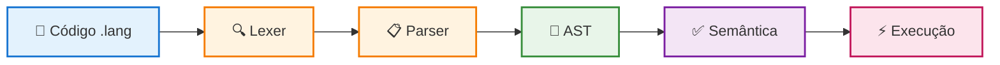

# 🚀 Interpretador G16

## Compiladores 1 | UnB 2025.2

**Universidade de Brasília (UnB)**  
Faculdade de Ciência e Tecnologia em Engenharia (FCTE)  
**Professor:** Sergio Freitas

---

## 👥 Equipe - Grupo 16

| | | | | |
|:---:|:---:|:---:|:---:|:---:|
| [](https://github.com/daramariabs)<br>**[Dara Maria](https://github.com/daramariabs)** | [](https://github.com/davirnunes)<br>**[Davi Nunes](https://github.com/davirnunes)** | [](https://github.com/GustOki)<br>**[Gustavo Oki](https://github.com/GustOki)** | [](https://github.com/marcosfilhopq)<br>**[Marcos Filho](https://github.com/marcosfilhopq)** | [](https://github.com/SamaraAlvess)<br>**[Samara Alves](https://github.com/SamaraAlvess)** |

---

## 💡 Sobre o Projeto

Interpretador para uma linguagem de programação simplificada desenvolvido em **C**, aplicando conceitos de Compiladores 1 através da metodologia **Problem Based Learning (PBL)**.

**Pipeline de Execução:**



---

## 🚀 Início Rápido

```bash
# Clonar o repositório
git clone https://github.com/GustOki/interpretador-G16.git
cd interpretador-G16

# Compilar
make

# Executar exemplo
./build/interpretador tests/valid/hello_world.lang
```

---

## 📚 Documentação

| 📖 Página | 📝 Conteúdo |
|:----------|:-----------|
| **[📥 Como Rodar](instalacao.md)** | Instalação, compilação e comandos úteis |
| **[💻 Linguagem](linguagem.md)** | Sintaxe, exemplos e recursos suportados |
| **[📅 Sprints](sprints.md)** | Cronograma e progresso do projeto |
| **[📋 Atas](atas.md)** | Registro das reuniões da equipe |

---

## 🛠️ Stack Tecnológico

| Componente | Tecnologia |
|:-----------|:-----------|
| **Análise Léxica** | Flex (Fast Lexical Analyzer) |
| **Análise Sintática** | Bison (GNU Parser Generator) |
| **Runtime** | C (AST, Tabela de Símbolos, Interpretador) |
| **Build System** | GNU Make |
| **Testes** | Python 3 |

---

## ✨ Recursos Implementados

| Categoria | Recursos |
|:----------|:---------|
| **Tipos de Dados** | `int` · `float` · `char` · `string` |
| **Estruturas de Controle** | `if/else` · `while` · `for` · `do-while` · `switch-case` |
| **Operadores** | Aritméticos (`+` `-` `*` `/`) · Relacionais (`==` `!=` `<` `>` `<=` `>=`) |
| **Recursos Avançados** | Arrays · Indexação · Sistema de Testes · Tratamento de Erros |


---

## 🔗 Links Úteis

[](https://github.com/GustOki/interpretador-G16)
[](instalacao.md)

---

!!! info "Projeto Educacional"
    📄 Projeto desenvolvido para fins educacionais - UnB 2025.2