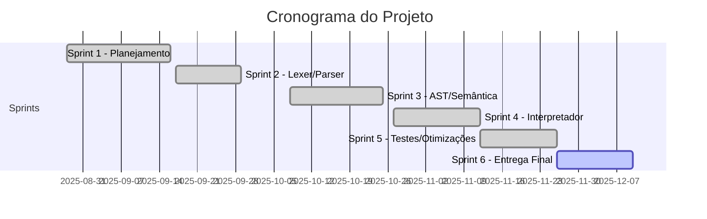

# Sprints do Projeto

## Sprint 1 - Planejamento e Configuração
**Período:** 28/08/2025 - 16/09/2025

### Objetivos
- [x] Formação das equipes
- [x] Configuração do ambiente de desenvolvimento
- [x] Definição da gramática inicial
- [x] Setup do repositório Git

### Contribuições da Equipe

| Integrante | Contribuições |
|------------|---------------|
| **Gustavo Oki** | Estrutura inicial do projeto com Flex e Bison, criação do repositório, configuração de arquivos base (lexer.l, parser.y), LICENSE e README inicial |
| **Marcos Filho** | Adicionando branch "marcos" para desenvolvimento paralelo |
| **Dara Maria** | Planejamento inicial e revisão da estrutura |
| **Davi Nunes** | Configuração do ambiente local |
| **Samara Alves** | Documentação e planejamento das sprints |

---

## Sprint 2 - Análise Léxica e Sintática
**Período:** 17/09/2025 - 29/09/2025

### Objetivos
- [x] Implementação do Lexer (Flex)
- [x] Primeiras regras do Parser (Bison)
- [x] Definição completa de tokens
- [x] **Entrega: P1**

### Contribuições da Equipe

| Integrante | Contribuições |
|------------|---------------|
| **Gustavo Oki** | Gerando executável, reestruturando o projeto, tratamento de erros sintáticos, atualização do Makefile, correção de pastas na main, testando tratamento de erro sintático |
| **Marcos Filho** | Adição da Árvore Sintática Abstrata (AST), atualização de parser e estrutura |
| **Dara Maria** | Configuração do Make, adiciona arquivo .gitignore |
| **Samara Alves** | Atualização e revisão do README.md com documentação detalhada |
| **Davi Nunes** | Configuração do ambiente e testes iniciais |

---

## Sprint 3 - AST e Análise Semântica
**Período:** 08/10/2025 - 25/10/2025

### Objetivos
- [x] Construção da AST
- [x] Implementação da Tabela de Símbolos
- [x] Verificação básica de tipos
- [x] Análise de escopo

### Contribuições da Equipe

| Integrante | Contribuições |
|------------|---------------|
| **Dara Maria** | Implementação da tabela de símbolos (symtable), suporte sintático para variáveis e atribuições, integração da tabela de símbolos no interpretador |
| **Samara Alves** | Implementação da tabela de símbolos, melhorias em tipos, implementação do if simples, atualizações estruturais |
| **Marcos Filho** | Feature: Adicionado if e ponto-vírgula, atualizações no AST (ast.h, ast.c), parser.y e lexer.l |
| **Gustavo Oki** | Adicionando if simples, atualização do .gitignore e README.md |
| **Davi Nunes** | Testes e validações da AST |

---

## Sprint 4 - Interpretador e Runtime
**Período:** 27/10/2025 - 12/11/2025

### Objetivos
- [x] Motor de execução do interpretador
- [x] Avaliação de expressões
- [x] Implementação de estruturas de controle
- [x] **Entrega: P2**

### Contribuições da Equipe

| Integrante | Contribuições |
|------------|---------------|
| **Dara Maria** | Implementação completa do switch-case (sintaxe, AST e execução), mudança de REPL para modo de script, remoção da pasta build versionada, correção da lógica do switch-case e break |
| **Davi Nunes** | Implementação do comando do-while completo, implementação do FOR no AST, correção de erros no FOR |
| **Marcos Filho** | Implementação de tipos (int, float, char, string), formatação de saída, tratamento de erros no interpretador, remoção de arquivos de build do versionamento |
| **Gustavo Oki** | Implementação de vetores no interpretador, atualização de simbolo.c e interpretador.c, criação de testes, otimização de código |
| **Samara Alves** | Casos de testes, merge com branches, atualizações estruturais |

---

## Sprint 5 - Testes e Otimizações
**Período:** 12/11/2025 - 26/11/2025

### Objetivos
- [x] Sistema de testes completo
- [x] Tratamento robusto de erros
- [x] Casos de teste adicionais
- [x] Documentação técnica

### Contribuições da Equipe

| Integrante | Contribuições |
|------------|---------------|
| **Dara Maria** | Bateria de testes de regressão com gabaritos (.out), script de automação de testes, correção de verificação de tipos em operações, suporte para comentários (linha e bloco), atualização completa da documentação, limpeza de código |
| **Gustavo Oki** | Otimização do Makefile, otimização de parser.y e lexer.l, otimização geral de códigos, configuração do MkDocs e GitHub Actions, atualização do README.md |
| **Samara Alves** | Casos de testes funcionais, merge e integração de branches, atualização do README.md |
| **Marcos Filho** | Tratamento de erros no interpretador, testes de validação |
| **Davi Nunes** | Testes e validações finais |

---

## Sprint 6 - Entrega Final e Documentação
**Período:** 26/11/2025 - 10/12/2025

### Objetivos
- [x] Configuração do GitHub Pages
- [x] Documentação web completa
- [ ] Preparação para entrevistas individuais
- [ ] **Entrega: Final**

### Contribuições da Equipe

| Integrante | Contribuições |
|------------|---------------|
| **Gustavo Oki** | Configuração do MkDocs e GitHub Actions para deploy automático da documentação, atualização final do README.md |
| **Dara Maria** | Revisão final da documentação, testes finais de segurança |
| **Samara Alves** | Revisão e atualização da documentação |
| **Marcos Filho** | Preparação de materiais para apresentação |
| **Davi Nunes** | Validação final do projeto |

---

## Progresso Geral

---

## Principais Funcionalidades Implementadas

| Funcionalidade | Responsável Principal | Sprint |
|----------------|----------------------|--------|
| **Lexer e Parser** | Gustavo Oki, Marcos Filho | Sprint 2 |
| **Tabela de Símbolos** | Dara Maria, Samara Alves | Sprint 3 |
| **Estrutura If/Else** | Samara Alves, Gustavo Oki | Sprint 3 |
| **Switch-Case** | Dara Maria | Sprint 4 |
| **Do-While** | Davi Nunes | Sprint 4 |
| **For Loop** | Davi Nunes | Sprint 4 |
| **Vetores/Arrays** | Gustavo Oki | Sprint 4 |
| **Sistema de Tipos** | Marcos Filho, Davi Nunes | Sprint 4 |
| **Tratamento de Erros** | Marcos Filho, Dara Maria | Sprint 4-5 |
| **Sistema de Testes** | Dara Maria, Samara Alves | Sprint 5 |
| **Documentação Web** | Gustavo Oki | Sprint 6 |

---

[← Voltar](index.md)